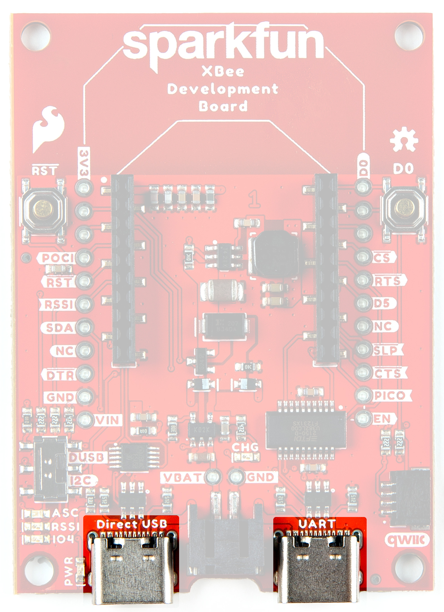
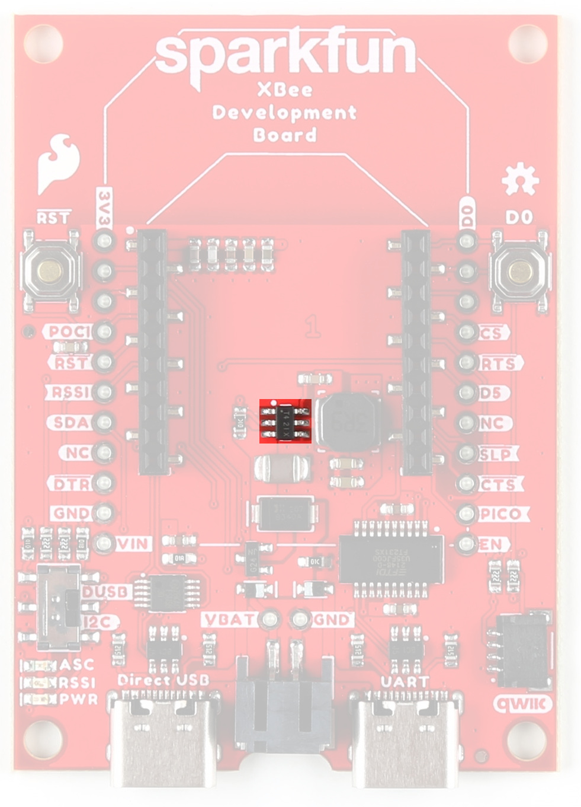
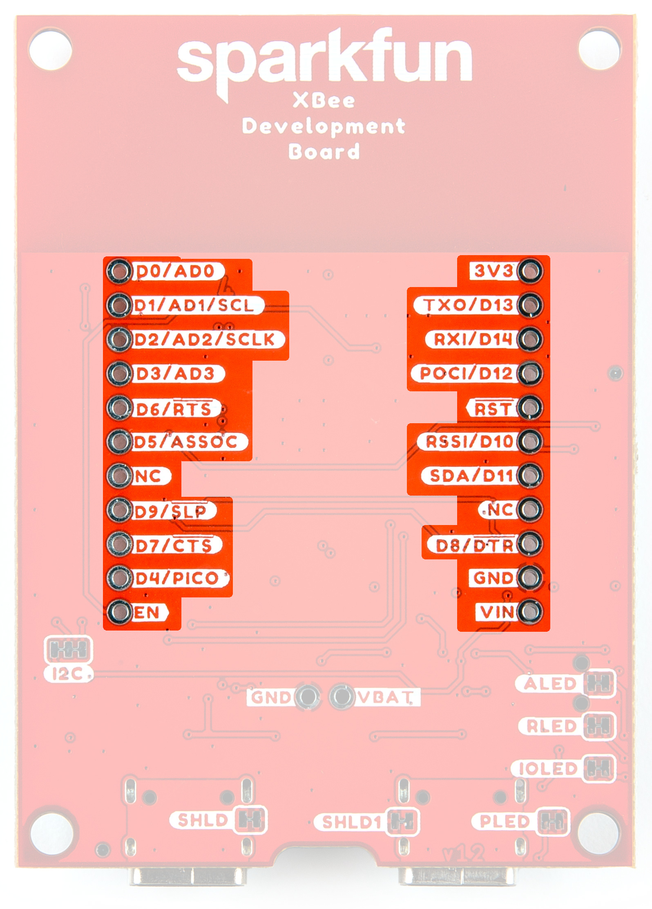

###XBee Smart Modem Socket

We've kept the XBee socket consistent with the XBee pinout, so this breakout board is backwards compatible. In order to take full advantage of this board, we recommend one of the newer Digi XBee boards. Either the [Digi XBee 3 Low-Power LTE-M/NB-IoT, GNSS, no SIM](https://www.sparkfun.com/products/22329) or the [Digi XBee 3 North America LTE Cat 1, 3G, GNSS, no SIM](https://www.sparkfun.com/products/22330). 

<figure markdown>
[{ width="400" }](assets/imgs/21636-XBeeDevBoard-XBeeSocket.jpg "Click to enlarge")
<figcaption markdown>XBeeSocket</figcaption>
</figure>

###Power

There are two USB-C connectors on the board. One is a UART/I2C connector, the other is the direct USB connector. Input VCC range is between <b>3.3V-4.3V</b>. 

<figure markdown>
[{ width="400" }](assets/imgs/21636-XBeeDevBoard-USBC.jpg "Click to enlarge")
<figcaption markdown>USB-C</figcaption>
</figure>

###Qwiic Connector

The Qwiic connector on the SparkFun XBee Development Board provides power and I2C connectivity to Qwiic breakout boards. 

<figure markdown>
[{ width="400" }](assets/imgs/21636-XBeeDevBoard-QwiicConnex.jpg "Click to enlarge")
<figcaption markdown>Qwiic Connector</figcaption>
</figure>

###USB Switch

The USB switch allows you to select between Direct USB and I2C. Default is Low (I2C/SDA).

<figure markdown>
[{ width="400" }](assets/imgs/21636-XBeeDevBoard-DUSB-I2CSwitch.jpg "Click to enlarge")
<figcaption markdown>DUSB I2C Switch</figcaption>
</figure>

###Buck Converter - AP63203

The AP63203 Buck Converter ensures appropriate power supply to the components of the board. VIN range is <b>3.8V-5.5V</b>. Output is 2A max. 

<figure markdown>
[{ width="400" }](assets/imgs/21636-XBeeDevBoard-Buck Converter-AP63203.jpg "Click to enlarge")
<figcaption markdown>AP63203 Buck Converter</figcaption>
</figure>

###USB to UART Bridge

The FT231XS translates data between your computer and the XBee. This is one of our favorite chips because it supports all computer platforms and it's easy to work with. If this is the first FTDI chip you've ever connected to your computer (it probably won't be your last), there is some driver installation to get out of the way. We've written a tutorial detailing [How to Install FTDI Drivers tutorial](tutorials/74).

<figure markdown>
[{ width="400" }](assets/imgs/21636-XBeeDevBoard-FT231XS.jpg "Click to enlarge")
<figcaption markdown>FT231XS USB to UART Bridge</figcaption>
</figure>

###Lipo Battery Connector

The SparkFun XBee Development Board includes support for single-cell lithium-polymer (LiPo) batteries, which plug into the board's black 2-pin JST connector. LiPos are perfect for projects on-the-go, or those that just need a little extra oomph. 

<figure markdown>
[{ width="400" }](assets/imgs/21636-XBeeDevBoard-BatteryConnector.jpg "Click to enlarge")
<figcaption markdown>Battery Connector</figcaption>
</figure>

###GPIO

We've broken out the XBee pins to plated through holes on either side of the board. 

<figure markdown>
[{ width="400" }](assets/imgs/21636-XBeeDevBoard-GPIO.jpg "Click to enlarge")
<figcaption markdown>GPIO</figcaption>
</figure>

###Buttons 

There are two buttons - D0 and RST. Reset allows you to reset the board without unplugging, the D0 button is provided for user-defined functionality. 

<figure markdown>
[{ width="400" }](assets/imgs/21636-XBeeDevBoard-ResetandD0Buttons.jpg "Click to enlarge")
<figcaption markdown>Reset and D0 Buttons</figcaption>
</figure>

###LEDs

There are three LEDs on the board: 

<figure markdown>
[{ width="400" }](assets/imgs/21636-XBeeDevBoard-LEDs.jpg "Click to enlarge")
<figcaption markdown>LEDs</figcaption>
</figure>

####PWR

This LED lights up when power is provided to the board. 

####ASC
This LED on the development board blinks when the XBee is registered to the cellular network.

| Blink | Timing | Meaning |
| --- | --- | --------- |
| On | Solid | Not joined to a mobile network |
| Double Blink | ½ second | The last TCP/UDP/SMS attempt failed. If the LED has this pattern, you may need to check DI (Remote Manager Indicator) or CI (Protocol/Connection Indication) for the cause of the error. | 
| Single blink | 1 Second | Normal Operation |

####RSSI 
This LED is the Received Signal Strength Indicator. When configured, it reflects the received signal strength.

RSSI PWM
The RSSI/PWM output is enabled continuously, unlike other XBee products where the output is enabled for a short period of time after each received transmission. If running on the XBIB development board, DIO10 is connected to the RSSI LEDs, which may be interpreted as follows:

| PWM duty cycle | Number of LEDs turned on | Received signal strength (dBm) |
| --- | --- | --------- |
| 79.39% or more | 3 | 83 dBm or higher |
| 62.42% to 79.39% | 2 | -93 to -83 dBm |
| 45.45% to 62.42% | 1 | -103 to -93 dBm |
| Less than 45.45% | 0 | Less than -103 dBm, or no cellular network connection |

###Jumpers

####SHLD/SHLD1

For most applications, the single point grounding of the Direct USB or UART at the USB-C connector is sufficient. However, should you run into problems with EMI/EMC, we've provided jumpers that allow you to disconnect either connector from ground.

Cut the SHLD jumper for the UART USB-C; cut the SHLD1 jumper for Direct USB. 

<figure markdown>
[{ width="400" }](assets/imgs/21636-XBeeDevBoard-Jumper-ShldandShld1.jpg "Click to enlarge")
<figcaption markdown>Shield Jumpers</figcaption>
</figure>

####ALED/PLED

If power consumption is an issue (or if you just don't like the LEDs), cut the respective jumper to sever power to the LED. 

* PLED: Red
* ALED: Blue
* RLED (RSSI): Yellow

<figure markdown>
[{ width="400" }](assets/imgs/21636-XBeeDevBoard-Jumper-LEDs.jpg "Click to enlarge")
<figcaption markdown>LED Jumpers</figcaption>
</figure>

####I2C 

The I2C jumper pulls the SDA and SCL pins to VDD (normally 3.3V) through two 2.2K Ohm resistors. If you have multiple Qwiic devices on the same bus you may want to disable these by opening the jumper (assuming they are also operating at 3.3V logic).

<figure markdown>
[{ width="400" }](assets/imgs/21636-XBeeDevBoard-Jumper-I2C.jpg "Click to enlarge")
<figcaption markdown>I2C Jumper</figcaption>
</figure>

###Board Outline

The overall size of the SparkFun XBee Development Board is 1.8" by 2.5". For specific measurements, see the image below. 

<figure markdown>
[{ width="600" }](assets/BoardFiles/21636-SparkFun_XBee3_Cat1_Smart_Modem-BoardOutline.png "Click to enlarge")
<figcaption markdown>Board Outline</figcaption>
</figure>
