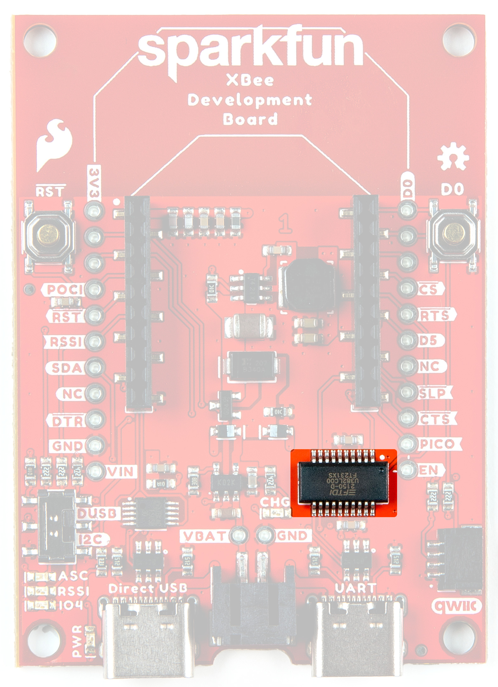

###XBee Smart Modem Socket

We've kept the XBee socket consistent with the XBee pinout, so this breakout board is backwards compatible. 

<figure markdown>
[{ width="400" }](../assets/imgs/21636-XBeeDevBoard-XBeeSocket.jpg "Click to enlarge")
<figcaption markdown>XBeeSocket</figcaption>
</figure>

###Power
USB-C Connectors
Input VCC Range: 3.3V-4.3V

###Qwiic Connector

The Qwiic connector on the SparkFun XBee 3 Cat 1 Smart Modem board provide power and I2C connectivity to Qwiic breakout boards. 

<figure markdown>
[{ width="400" }](../assets/imgs/21636-XBeeDevBoard-QwiicConnex.jpg "Click to enlarge")
<figcaption markdown>Qwiic Connector</figcaption>
</figure>

###USB Switch

The USB switch allows you to select between Direct USB and I2C. Default is Low (I2C/SDA).

<figure markdown>
[{ width="400" }](../assets/imgs/21636-XBeeDevBoard-DUSB-I2CSwitch.jpg "Click to enlarge")
<figcaption markdown>DUSB I2C Switch</figcaption>
</figure>

###Buck Converter - AP63203

The AP63203 Buck Converter ensures appropriate power supply to the compontents of the board. VIN range is <b>3.8V-5.5V</b>. Output is 2A max. 

###USB to UART Bridge

The FT231XS translates data between your computer and the XBee. This is one of our favorite chips because it supports all computer platforms and it's easy to work with. If this is the first FTDI chip you've ever connected to your computer (it probably won't be your last), there is some driver installation to get out of the way. We've written a tutorial detailing [How to Install FTDI Drivers tutorial](tutorials/74).

<figure markdown>
[{ width="400" }](../assets/imgs/21636-XBeeDevBoard-FT231XS.jpg "Click to enlarge")
<figcaption markdown>FT231XS USB to UART Bridge</figcaption>
</figure>

###Lipo Battery Connector

The SparkFun XBee 3 Cat 1 Smart Modem Dev Board includes support for single-cell lithium-polymer (LiPo) batteries, which plug into the board's black 2-pin JST connector. LiPos are perfect for projects on-the-go, or those that just need a little extra oomph. 

<figure markdown>
[{ width="400" }](../assets/imgs/21636-XBeeDevBoard-BatteryConnector.jpg "Click to enlarge")
<figcaption markdown>Battery Connector</figcaption>
</figure>

###GPIO

###Buttons 

There are two buttons - D0 and RST. 

<figure markdown>
[{ width="400" }](../assets/imgs/21636-XBeeDevBoard-ResetandD0Buttons.jpg "Click to enlarge")
<figcaption markdown>Reset and D0 Buttons</figcaption>
</figure>

###LEDs

There are three LEDs on the board: 

<figure markdown>
[{ width="400" }](../assets/imgs/21636-XBeeDevBoard-LEDs.jpg "Click to enlarge")
<figcaption markdown>LEDs</figcaption>
</figure>

####PWR

Lights up when power is provided to the board. 

####ASC
The LED on the development board blinks when the XBee is registered to the cellular network.

<table class="tg" align="left">
  <tr>
    <th width="20%"><b>Blink</b></th>
    <th width="20%"><b>Timing</b></th>
    <th width="60%"><b>Meaning</b></th>
  </tr>
  <tr>
    <td>On</td>
    <td>Solid</td>
    <td>Not joined to a mobile network</td>
  </tr>
  <tr>
    <td>Double blink</td>
    <td>½ second</td>
    <td>The last TCP/UDP/SMS attempt failed. If the LED has this
pattern, you may need to check DI (Remote Manager
Indicator) or CI (Protocol/Connection Indication) for the cause
of the error.</td>
  </tr>
  <tr>
    <td>Single blink</td>
    <td>1 second</td>
    <td>Normal operation</td>
  </tr>
</table>

####RSSI 
Received Signal Strength Indicator - When configured, this LED reflects the received signal strength

RSSI PWM
The RSSI/PWM output is enabled continuously unlike other XBee products where the output is enabled for a short period of time after each received transmission. If running on the XBIB development board, DIO10 is connected to the RSSI LEDs, which may be interpreted as follows:

<table class="tg" align="left">
  <tr>
    <th width="20%"><b>PWM duty cycle</b></th>
    <th width="20%"><b>Number of LEDs turned on</b></th>
    <th width="60%"><b>Received signal strength (dBm)</b></th>
  </tr>
  <tr>
    <td>79.39% or more</td>
    <td>3</td>
    <td>-83 dBm or higher</td>
  </tr>
  <tr>
    <td>62.42% to 79.39%</td>
    <td>2</td>
    <td> -93 to -83 dBm</td>
  </tr>
  <tr>
    <td>45.45% to 62.42%</td>
    <td>1</td>
    <td>-103 to -93 dBm</td>
  </tr>
  <tr>
    <td>Less than 45.45%</td>
    <td>0</td>
    <td>Less than -103 dBm, or no cellular network connection</td>
  </tr>
</table>

###Jumpers

####SHLD/SHLD1

For most applications, the single point grounding of the Direct USB or UART at the USB-C connector is sufficient. However, should you run into problems with EMI/EMC, we've provided jumpers that allow you to disconnect either connector from ground.

Cut the SHLD jumper for the UART USB-C; cut the SHLD1 jumper for Direct USB. 

<figure markdown>
[{ width="400" }](../assets/imgs/21636-XBeeDevBoard-Jumper-ShldandShld1.jpg "Click to enlarge")
<figcaption markdown>Shield Jumpers</figcaption>
</figure>

####ALED/PLED

If power consumption is an issue (or if you just don't like the LEDs), cut the respective jumper to sever power to the LED. 

* PLED: Red
* ALED: Blue

<figure markdown>
[{ width="400" }](../assets/imgs/21636-XBeeDevBoard-Jumper-LEDs.jpg "Click to enlarge")
<figcaption markdown>LED Jumpers</figcaption>
</figure>

####I2C 

The I2C jumper pulls the SDA and SCL pins to VDD (normally 3.3V) through two 2.2K Ohm resistors. If you have multiple Qwiic devices on the same bus you may want to disable these by opening the jumper (assuming they are also operating at 3.3V logic).

<figure markdown>
[{ width="400" }](../assets/imgs/21636-XBeeDevBoard-Jumper-I2C.jpg "Click to enlarge")
<figcaption markdown>I2C Jumper</figcaption>
</figure>

###Board Outline

The overall size of the SparkFun XBee Development Board is 1.8" by 2.5". For specific measurements, see the image below. 

<figure markdown>
[{ width="600" }](../assets/BoardFiles/21636-SparkFun_XBee3_Cat1_Smart_Modem-BoardOutline.png "Click to enlarge")
<figcaption markdown>Board Outline</figcaption>
</figure>
